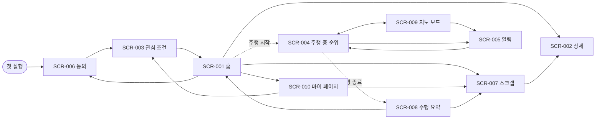

# 화면 흐름

```mermaid
flowchart LR
    Start([첫 실행]) --> Consent[SCR-006 동의]
    Consent --> Cond[SCR-003 관심 조건]
    Cond --> Home[SCR-001 홈]
    Home --> Detail[SCR-002 상세]
    Home --> Scrap[SCR-007 스크랩]
    Scrap --> Detail
    Home --> MyPage[SCR-010 마이 페이지]
    MyPage --> Scrap
    MyPage --> Cond
    Home --> Consent
    Home -. 주행 시작 .-> Drive[SCR-004 주행 중 순위]
    Drive <--> Map[SCR-009 지도 모드]
    Map --> Alert
    Drive --> Alert[SCR-005 알림]
    Alert --> Drive
    Drive -. 주행 종료 .-> Summary[SCR-008 주행 요약]
    Summary --> Scrap
    Summary --> Home
```

## 규칙

- 주행 중에는 SCR-004, SCR-009, SCR-005만 표시합니다. 다른 화면에 있었다면 상태를 저장하고 전환합니다(S-005).
- 다단계 이동은 홈에서 최대 2단계로 제한합니다(DD-009, 제안값).
