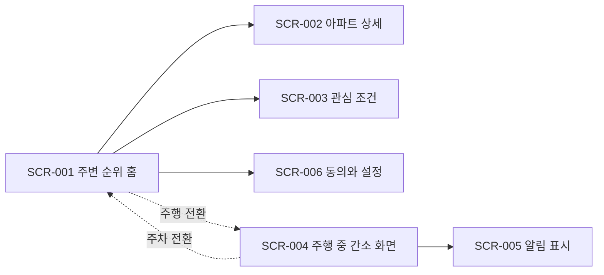

# 화면 흐름

초안입니다. 시나리오 확정 후 갱신합니다.

```mermaid
flowchart LR
    Home[SCR-001 주변 순위 홈] --> Detail[SCR-002 아파트 상세]
    Home --> Interest[SCR-003 관심 조건]
    Home --> Settings[SCR-006 동의와 설정]
    Home -. 주행 전환 .-> Driving[SCR-004 주행 중 간소 화면]
    Driving -. 주차 전환 .-> Home
    Driving --> Alert[SCR-005 알림 표시]
```

## 첫 실행 흐름

첫 실행 시 SCR-006에서 위치 사용 동의를 받은 뒤 SCR-001로 이동합니다.
